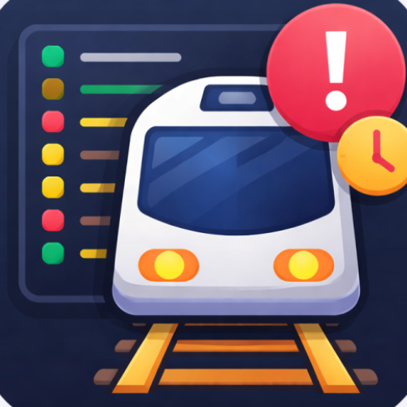
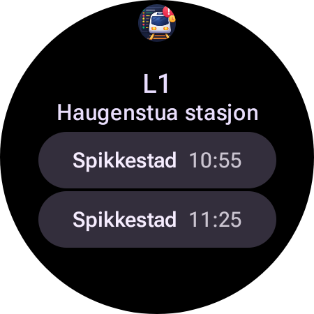

# Togavganger

En Wear OS-applikasjon for å vise toganganger fra ditt valgte stoppested.



## Oversikt

Togavganger er en Wear OS-app som viser sanntidsinformasjon om toganganger fra ditt favorittstoppested. Appen henter data fra Entur API og viser opptil 6 avganger med informasjon om destinasjon, planlagt avgangstid og eventuelle forsinkelser.

## Funksjoner

- **Tile-visning**: Rask oversikt over neste avganger direkte på klokken
- **Watch face-komplikasjon**: Vis antall minutter til neste tog (kort: tallet, lang: "x min L1")
- **Detaljvisning**: Se opptil 6 avganger med full informasjon
- **Forsinkelsesindikasjon**: Visuell markering av forsinkede tog
- **Sanntidsdata**: Automatisk oppdatering fra Entur API
- **Klikkbare avganger**: Trykk på en avgang for å se detaljert informasjon
- **Stoppested-valg**: Velg ditt favorittstoppested (kommer snart)

## Screenshots



## Teknologi

- **Kotlin** - Programmeringsspråk
- **Jetpack Compose** - UI-rammeverk for Wear OS
- **Material Design 3** - Designsystem
- **MVI Pattern** - State management
- **Repository Pattern** - Datahåndtering
- **Entur API** - Toginformasjon

## Byggeapplikasjonen

1. Klon repositoryet
2. Åpne prosjektet i Android Studio
3. Bygg og kjør på en Wear OS-enhet eller emulator

### Gradle cache issues

If builds fail with "Could not read workspace metadata from ... metadata.bin", the Gradle transform cache may be corrupted. Try:

1. **Quick fix** (uses temporary cache):
   ```powershell
   $env:GRADLE_USER_HOME="$env:TEMP\gradle-fresh"; .\gradlew clean assembleDebug
   ```

2. **Permanent fix**: Restart your PC, then (before opening any IDE) run `fix-gradle-cache.ps1` to remove the corrupted cache and rebuild.

## Lisens

Denne applikasjonen er utviklet for personlig bruk.
